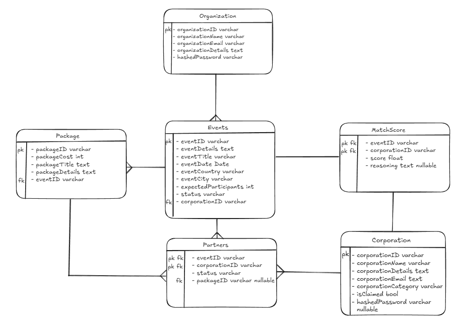

# LetsMeet (temp, name TBD)

## Table of Contents
*   [Explanation](#explanation)
*   [ERD](#erd)
*   [API Documentation (backend)](#api)
*   [Pages Documentation (frontend)](#pages)
## Explanation
Scrapes potential partner(preset database for this project, allowed by lecturer), then do matching based on fit score. Organizations could see scraped partners who are potentially fit determined by a LLM, and corporations can go to events who are currently seeking partnerships also given a fit score. Fit score is determined by comparing event and organization details to corporation details and vice versa. 

## ERD

#### Non self explanatory stuff:  
- MatchScore and Partners are divided because the partners table would store a score for partnerships that havent been formed if the score was put there.
- isClaimed on corporation is incase a "scraped" corporation signs up to the website
- pastEvents is to be used as additional context for fit score

## API
### 1. Authentication & Onboarding
**Note for Backend:**
* **Corporation Registration:** Must implement "Claim Logic". Check if the domain exists in `Corporation` table.
    * If **Found**: Update `isClaimed = true`, set `hashedPassword`, and link to new `UserID`.
    * If **Not Found**: Create new `Corporation` entry.

#### `POST /auth/org/register`
Register a new Organization account.
```json
{
  "email": "chairperson@cs-society.edu",
  "password": "securePassword123",
  "name": "Computer Science Society",
  "details": "A student-run community for CS students..."
}
```

#### `POST /auth/org/login`
Login for Organizations.
```json
{
  "email": "chairperson@cs-society.edu",
  "password": "securePassword123"
}
```

#### `POST /auth/corp/register`
Register a Corporation. **(Triggers Claim Logic)**
```json
{
  "email": "marketing@google.com",
  "password": "securePassword123",
  "name": "Google",
  "details": "A technology company specializing in..."
}
```

#### `POST /auth/corp/login`
Login for Corporations.
```json
{
  "email": "marketing@google.com",
  "password": "securePassword123"
}
```

#### `POST /auth/logout`  

logout for everyone  
no response body, just make sure to set withCredentials: true
---

### 2. Event Management 

#### `GET /org/events`
Retrieve all events

#### `POST /org/events`
Create a new event.
```json
{
  "title": "Annual Hackathon 2026",
  "date": "2026-10-10T09:00:00Z",
  "details": "A 24-hour hackathon focused on AI and sustainability..."
}
```

#### `GET /org/events/:id`
Get details of a specific event.

#### `PUT /org/events/:id`
Update an event.
```json
{
  "title": "Annual Hackathon 2026 (Updated)",
  "details": "Updated details regarding the venue..."
}
```

---

### 3. AI Discovery & Matching
**Note:** All lists returned here must be **sorted by `score` DESC**.

#### `GET /events/:id/matches`
**(For Org)** Get a ranked list of Corporations that fit a specific event.
* **Response:**
```json
[
  {
    "corporationID": "uuid-1",
    "name": "Tech Corp",
    "score": 98.5,
    "isClaimed": true,
    "aiReasoning": "Tech Corp has a history of sponsoring hackathons..."
  },
  {
    "corporationID": "uuid-2",
    "name": "Bank of Scraped Data",
    "score": 85.0,
    "isClaimed": false,
    "aiReasoning": "Financial institutions often look for..."
  }
]
```

#### `GET /corp/opportunities`
**(For Corp)** Get a ranked list of Events that fit the logged-in Corporation's profile.
* **Response:**
```json
[
  {
    "eventID": "uuid-5",
    "title": "CS Career Fair",
    "orgName": "University CS Dept",
    "score": 92.0,
    "date": "2026-11-05"
  }
]
```

#### `GET /corp/:id/history`
Get the `pastEvents` list for a corporation (provides context on what they usually sponsor).
* **Response:**
```json
[
  {
    "pastEventID": "uuid-9",
    "title": "Open Source Summit 2024",
    "date": "2024-05-12",
    "details": "Contributing to open source projects....."
  }
]
```

---

### 4. Partnership Management

#### `POST /partners/contact`
Initiate a partnership (Send Proposal).
```json
{
  "eventID": "uuid-of-event",
  "corporationID": "uuid-of-corp"
}
```

#### `GET /partners/requests`
View pending partnership requests for the logged-in user.

#### `PUT /partners/status`
Accept or Reject a partnership proposal.
```json
{
  "eventID": "uuid-of-event",
  "corporationID": "uuid-of-corp",
  "status": "accepted" // or "rejected"
}
```
## Pages

### 1. Public Pages (Authentication & Landing)

#### **Landing Page**
* **Route:** `/`
* **Purpose:** Hero section explaining the "AI Matching" value prop. Two distinct call-to-action buttons: "For Organizations" and "For Corporations".
* **Key Components:**
    * Hero Banner ("Find your perfect sponsor in seconds").
    * How it Works (Scrape -> Match -> Connect).

#### **Auth Pages**
* **Routes:**
    * `/login/org` & `/register/org`
    * `/login/corp` & `/register/corp`
* **Purpose:** Entry points for the two user types.
* **Key Logic:**
    * **Corp Register:** When a user types their email/domain, show a small loader. *Backend Note:* This is where the system silently checks for the "Claim" logic, but the UI remains standard.
* **Key API Calls:**
    * `POST /auth/org/register`
    * `POST /auth/corp/register`

---

### 2. Organization Portal 

#### **Page: Organization Dashboard**
* **Route:** `/org/dashboard`
* **Purpose:** Overview of all events managed by this student organization.
* **UI Components:**
    * **"Create New Event" Button:** Prominent floating action button or header button.
    * **Event Cards List:** Displays brief details (Title, Date).
* **Key API Calls:**
    * `GET /org/events` (Load list)

#### **Page: Create / Edit Event**
* **Route:** `/org/events/new` or `/org/events/:id/edit`
* **Purpose:** Form to input event details.
* **UI Components:**
    * **Rich Text Editor:** For `details` (Crucial for the AI to work well—encourage users to be descriptive).
    * **Save Button:** "Save & Find Matches" (Triggers the async matching).
* **Key API Calls:**
    * `POST /org/events` or `PUT /org/events/:id`

#### **Page: Event Details & AI Matches (The Core Feature)**
* **Route:** `/org/events/:id`
* **Purpose:** The "Menu" where they pick sponsors.
* **UI Components:**
    * **Event Info Header:** Title, Date, Description.
    * **The Match Table (Sorted by Score):**
        * **Columns:** Company Name, Fit Score (displayed as a Green/Yellow/Red badge), AI Reasoning (Tooltip or expandable row).
* **Key API Calls:**
    * `GET /events/:id/matches` (The ordered list)
    * `POST /partners/contact` (When "Send Proposal" is clicked)

#### **Page: Partnership Inbox**
* **Route:** `/org/inbox`
* **Purpose:** Track status of sent proposals.
* **UI Components:**
    * **List View:** Grouped by Status (`Potential` -> `Contacted` -> `Accepted` / `Rejected`).
* **Key API Calls:**
    * `GET /partners/requests`

---

### 3. Corporation Portal 

#### **Page: Opportunity Discovery**
* **Route:** `/corp/dashboard`
* **Purpose:** The "Feed" of relevant student events.
* **UI Components:**
    * **Smart Feed:** List of events sorted by `score`.
    * **Fit Card:** Each event card highlights *why* it matches (e.g., "98% Fit - Matches your interest in Hackathons").
* **Key API Calls:**
    * `GET /corp/opportunities`

#### **Page: Incoming Requests**
* **Route:** `/corp/inbox`
* **Purpose:** Review proposals sent by organizations.
* **UI Components:**
    * **Request Card:** Shows Event Name, Organization Name, and the Proposal.
    * **Action Buttons:** "Accept" (Green), "Reject" (Red).
* **Key API Calls:**
    * `GET /partners/requests`
    * `PUT /partners/status` (To accept/reject)

#### **Page: Corporate Profile & History**
* **Route:** `/corp/profile`
* **Purpose:** View/Edit company details and see the scraped `pastEvents` history that the AI is using.
* **UI Components:**
    * **History List:** Read-only list of past sponsorships (e.g., "Open Source Summit 2024").
* **Key API Calls:**
    * `GET /corp/:id/history`

---

### 4. Shared Components (Design System)

Some reusable components

1.  **`ScoreBadge`:** A visual component that takes a number (0-100) and renders a color-coded badge (e.g., >90 = Green, 70-89 = Yellow, <70 = Grey).
2.  **`MatchCard`:** A standard card layout used in both dashboards to display the "Opposite Party" details + Score.
3.  **`RichTextDisplay`:** To render the `details` text safely (since it might be long).