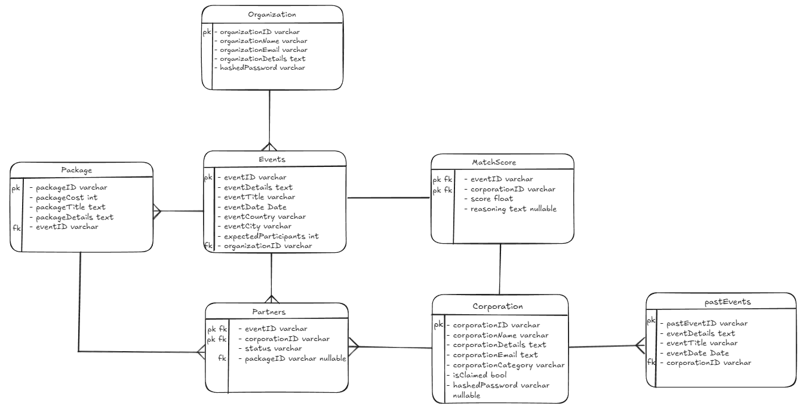

# LetsMeet (temp, name TBD)

## Table of Contents
*   [Explanation](#explanation)
*   [ERD](#erd)
*   [API Documentation (backend)](#api)
*   [Pages Documentation (frontend)](#pages)
## Explanation
Scrapes potential partner(preset database for this project, allowed by lecturer), then do matching based on fit score. Organizations could see scraped partners who are potentially fit determined by a LLM, and corporations can go to events who are currently seeking partnerships also given a fit score. Fit score is determined by comparing event and organization details to corporation details and vice versa. 

## ERD

#### Non self explanatory stuff:  
- MatchScore and Partners are divided because the partners table would store a score for partnerships that havent been formed if the score was put there.
- isClaimed on corporation is incase a "scraped" corporation signs up to the website

## API
### 1. Authentication & Onboarding
**Note for Backend:**
* **Corporation Registration:** Must implement "Claim Logic". Check if the domain exists in `Corporation` table.
    * If **Found**: Update `isClaimed = true`, set `hashedPassword`, and link to new `UserID`.
    * If **Not Found**: Create new `Corporation` entry.

#### `POST /auth/org/register`
Register a new Organization account.
```json
{
  "email": "chairperson@cs-society.edu",
  "password": "securePassword123",
  "name": "Computer Science Society",
  "details": "A student-run community for CS students..."
}
```

#### `POST /auth/org/login`
Login for Organizations.
```json
{
  "email": "chairperson@cs-society.edu",
  "password": "securePassword123"
}
```

#### `POST /auth/corp/register`
Register a Corporation. **(Triggers Claim Logic)**
```json
{
  "email": "marketing@google.com",
  "password": "securePassword123",
  "name": "Google",
  "details": "A technology company specializing in...",
  "category": "Technology"
}
```

#### `POST /auth/corp/login`
Login for Corporations.
```json
{
  "email": "marketing@google.com",
  "password": "securePassword123"
}
```
#### `GET /auth/me`
Returns the user, used to determine which view to render depending on the role  
Response body:
```json
{
    "message": "verified",
    "user": {
        "id": "71fa76d7-3211-480a-bf19-e68bd05bce29",
        "email": "marketing@google.com",
        "role": "corporation"
    }
}
```

#### `POST /auth/logout`  

logout for everyone  
no response body, just make sure to set withCredentials: true

---

### 2. Event Management 

#### `GET /events`
Retrieve all events (public).  
**Response:**
```json
{
  "success": true,
  "count": 2,
  "data": [
    {
      "id": "uuid",
      "title": "Annual Hackathon 2026",
      "details": "A 24-hour hackathon...",
      "date": "2026-10-10T09:00:00.000Z",
      "country": "Indonesia",
      "city": "Jakarta",
      "status": "pending",
      "expectedParticipants": 300,
      "organizationID": "uuid",
      "organization": { "name": "CS Society", "email": "cs@org.edu" },
      "_count": { "partners": 3 }
    }
  ]
}
```

#### `GET /org/events/:userID`
Retrieve all events from a specific organization.  
**Response:**
```json
{
  "success": true,
  "count": 1,
  "data": [ { "id": "uuid", "title": "...", "date": "...", "status": "pending", "..." : "..." } ]
}
```

#### `GET /corp/events/:userID`
Retrieve all events that a specific corporation has partners in (all status).  
**Response:**
```json
{
  "success": true,
  "count": 1,
  "data": [
    {
      "id": "uuid",
      "title": "Annual Hackathon 2026",
      "status": "pending",
      "organization": { "name": "CS Society", "email": "cs@org.edu" },
      "partners": [{ "status": "accepted" }]
    }
  ]
}
```

#### `POST /org/events`
Create a new event. **(Auth required, org only)**
```json
{
  "title": "Annual Hackathon 2026",
  "date": "2026-10-10T09:00:00Z",
  "details": "A 24-hour hackathon focused on AI and sustainability...",
  "country": "Indonesia",
  "city": "Jakarta",
  "status": "pending",
  "expectedParticipants": 300,
  "packages": [
    { "title": "Gold Sponsorship", 
      "cost": 5000, 
      "details": "Logo on banner, booth, etc." },
    { "title": "Silver Sponsorship", 
      "cost": 2000, 
      "details": "Logo on website" }
  ]
}
```

#### `GET /org/events/:id`
Get details of a specific event (includes organization info).

#### `GET /org/events/:id/partners`
Retrieve the partners and their status for a specific event.  
**Response:**
```json
{
  "success": true,
  "count": 2,
  "data": [
    {
      "eventID": "uuid",
      "corporationID": "uuid",
      "status": "pending",
      "packageID": null,
      "corporation": {
        "id": "uuid",
        "name": "Google",
        "email": "marketing@google.com",
        "details": "A technology company...",
        "category": "Technology"
      },
      "package": null
    }
  ]
}
```

#### `PUT /org/events/:id`
Update an event. **(Auth required, org only)**
```json
{
  "title": "Annual Hackathon 2026 (Updated)",
  "details": "Updated details regarding the venue...",
  "country": "Indonesia",
  "city": "Bandung",
  "expectedParticipants": 500,
  "status": "completed",
  "packages": [
    { 
      "id": "package-uuid",
      "title": "Gold Sponsorship",
      "cost": 6000,
      "details": "Speaker slot, 20 second ad-libs, logo on banner, booth, etc." },
    { 
      "title": "Bronze Sponsorship",
      "cost": 500,
      "details": "20 second ad-libs" }
  ]
}
```
When an event is completed, its associated partners will automatically be treated as past event history.

---

### 3. AI Discovery & Matching
**Note:** All lists returned here must be **sorted by `score` DESC**.

#### `GET /events/:id/matches`
**(For Org)** Get a ranked list of Corporations that fit a specific event.
* **Response:**
```json
[
  {
    "corporationID": "uuid-1",
    "name": "Tech Corp",
    "score": 98.5,
    "aiReasoning": "Tech Corp has a history of sponsoring hackathons..."
  },
  {
    "corporationID": "uuid-2",
    "name": "Bank of Scraped Data",
    "score": 85.0,
    "aiReasoning": "Financial institutions often look for..."
  }
]
```

#### `GET /corp/:id/matches`
**(For Corp)** Get a ranked list of Events that fit a specific event.
* **Response:**
```json
[
  {
    "eventID": "uuid-1",
    "name": "Tech Org",
    "score": 98.5,
    "aiReasoning": "yeah good event"
  },
  {
    "eventID": "uuid-2",
    "name": "Tech Org 2",
    "score": 60.5,
    "aiReasoning": "yeah bad event"
  },
]
```
#### `GET /corp/:id/history`
Get the past events list for a corporation.
* **Query Parameters:**
  * `eventStatus` (optional): Filter the past events by event status (e.g., `?eventStatus=completed`, or `?eventStatus=ongoing`).
  * `partnerStatus` (optional): Filter the past events by partnership status (e.g., `?partnerStatus=accepted`, or `?partnerStatus=rejected`).
* **Response:**
```json
[
  {
    "id": "uuid-9",
    "title": "Open Source Summit 2024",
    "date": "2024-05-12",
    "details": "Contributing to open source projects.....",
    "status": "completed"
  }
]
```

---

### 4. Partnership Management

#### `POST /partners`
Initiate a partnership (Send Proposal). Status defaults to `"pending"`.
```json
{
  "eventID": "uuid-of-event",
  "corporationID": "uuid-of-corp",
  "packageID": "uuid-of-package" // optional
}
```
**Response (201):**
```json
{
  "success": true,
  "data": {
    "eventID": "uuid",
    "corporationID": "uuid",
    "status": "pending",
    "packageID": null
  }
}
```

#### `PUT /partners`
Update a partnership (status, package, etc.).
```json
{
  "eventID": "uuid-of-event",
  "corporationID": "uuid-of-corp",
  "status": "accepted", // or "rejected" or "pending"
  "packageID": "uuid-of-package" // optional
}
```
**Response (200):**
```json
{
  "success": true,
  "data": {
    "eventID": "uuid",
    "corporationID": "uuid",
    "status": "accepted",
    "packageID": "uuid"
  }
}
```
#### `GET /partners`
Retrieve all partners for a given corporation or organization.
**Response (200):**
```json
{
  "success": true,
  "data": [
    {
      "eventID": "uuid",
      "corporationID": "uuid",
      "status": "pending",
      "packageID": null,
      "event": {
        "id": "uuid",
        "title": "Annual Hackathon",
        "date": "2026-10-10T09:00:00.000Z",
        "country": "Indonesia",
        "city": "Jakarta"
      },
      "corporation": {
        "id": "uuid",
        "name": "Tech Corp",
        "email": "contact@techcorp.com",
        "category": "Technology"
      }
    }
  ]
}
```

#### `GET /partners/all/:eventID`
Retrieve all partners for a given event.
**Response (200):**
```json
{
  "success": true,
  "data": [
    {
      "eventID": "uuid",
      "corporationID": "uuid",
      "status": "pending",
      "packageID": null
    }
  ]
}
```

#### `GET /partners/details/:eventID`
Get details of a specific partnership.
* **Query Parameters:**
  * `corporationID`: The UUID of the corporation.
```json
{
  "success": true,
  "data": {
    "eventID": "uuid",
    "corporationID": "uuid",
    "status": "pending",
    "packageID": null
  }
}
```

## Pages
### 1. Public Pages (Authentication & Landing)

#### **Landing Page**
* **Route:** `/`
* **Purpose:** Hero section explaining the "AI Matching" value prop. Two distinct call-to-action buttons: "For Organizations" and "For Corporations".
* **Key Components:**
    * Hero Banner ("Find your perfect sponsor in seconds").
    * How it Works (Scrape -> Match -> Connect).

#### **Auth Pages**
* **Routes:**
    * `/login/org` & `/register/org`
    * `/login/corp` & `/register/corp`
* **Purpose:** Entry points for the two user types.
* **Key Logic:**
    * **Corp Register:** When a user types their email/domain, show a small loader. *Backend Note:* This is where the system silently checks for the "Claim" logic, but the UI remains standard.
* **Key API Calls:**
    * `POST /auth/org/register`
    * `POST /auth/corp/register`

---

### 2. Organization Portal 

#### **Page: Organization Dashboard**
* **Route:** `/org/dashboard`
* **Purpose:** Overview of all events managed by this student organization.
* **UI Components:**
    * **"Create New Event" Button:** Prominent floating action button or header button.
    * **Event Cards List:** Displays brief details (Title, Date, Status).
* **Key API Calls:**
    * `GET /org/events/:userID` (Load list)

#### **Page: Create / Edit Event**
* **Route:** `/org/events/new` or `/org/events/:id/edit`
* **Purpose:** Form to input event details.
* **UI Components:**
    * **Rich Text Editor:** For `details` (Crucial for the AI to work well—encourage users to be descriptive).
    * **Dynamic Packages Section:** Ability to add, edit, or remove sponsorship packages (Title, Cost, and Details) directly in the form.
    * **Save Button:** "Save & Find Matches" (Triggers the async matching).
* **Key API Calls:**
    * `POST /org/events` or `PUT /org/events/:id`

#### **Page: Event Workspace (Matches & Inbox)**
* **Route:** `/org/events/:id`
* **Purpose:** The central hub for an event, split into tabs for finding sponsors and managing the partnership pipeline.
* **UI Components:**
    * **Event Info Header:** Title, Date, Description.
    * **Tab 1: AI Matches (Discovery):**
        * **The Match Table (Sorted by Score):**
            * **Columns:** Company Name, Fit Score (displayed as a Green/Yellow/Red badge), AI Reasoning (Tooltip or expandable row).
        * **Action:** "Status" button for each row.
    * **Tab 2: Inbox & Pipeline (Management):**
        * **Kanban or List View:** Shows all active partnerships for this event, grouped by Status (e.g., `Applied` [from corps], `Contacted` [by org], `Accepted`, `Rejected`).
        * **Action:** Dropdowns to manually update the status of any partnership.
* **Key API Calls:**
    * `GET /org/events/:id`
    * `GET /events/:id/matches`
    * `GET /events/:id/partners`
    * `POST /partners`
    * `PUT /partners/:id`

---

### 3. Corporation Portal 

#### **Page: Event Forum**
* **Route:** `/events`
* **Purpose:** View current events that are actively seeking partnerships.
* **UI Components:**
    * **Event Cards:** Shows Event Name, Organization Name, Event Details, and the AI Fit Score for the logged-in corporation.
    * **Package Details:** A view showing the available sponsorship packages for the event along with their costs and details.
    * **Action Button:** "Apply for Partnership" (Prompting the corporation to select an available `packageID` to apply for).
* **Key API Calls:**
    * `GET /events`
    * `POST /partners` (submitting with the chosen `packageID`)
#### **Page: Corporate Profile & History**
* **Route:** `/corp/profile`
* **Purpose:** View/Edit company details and see the past event history that the AI is using for context.
* **UI Components:**
    * **History List:** Read-only list of past sponsorships (e.g., "Open Source Summit 2024").
* **Key API Calls:**
    * `GET /corp/:id/history?eventStatus=completed` // filter for fully completed events
    * `GET /corp/:id/history?partnerStatus=accepted` // filter where the corp's partnership was accepted
    * `GET /corp/:id/history?eventStatus=completed&partnerStatus=accepted` // filter by both

---

### 4. Shared Components (Design System)

Some reusable components:

1.  **`ScoreBadge`:** A visual component that takes a number (0-100) and renders a color-coded badge (e.g., >90 = Green, 70-89 = Yellow, <70 = Grey).
2.  **`MatchCard`:** A standard card layout used in both dashboards to display the "Opposite Party" details + Score.
3.  **`RichTextDisplay`:** To render the `details` text safely (since it might be long).
4.  **`StatusPill`:** A small tag indicating partnership status (`Pending`, `Contacted`, `Accepted`, etc.) for use in the Event Workspace inbox.
